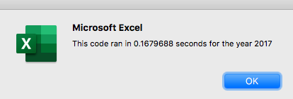
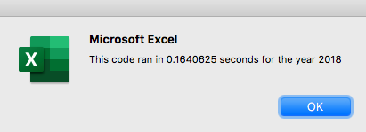
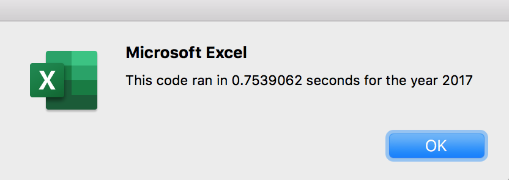
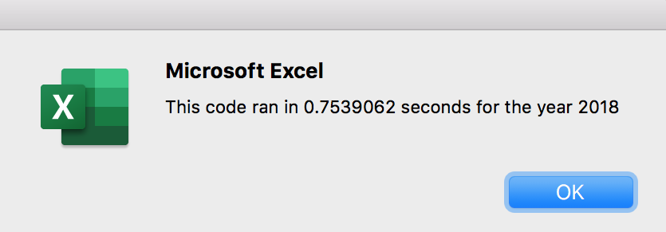

# VBA of Wall Street

## Overview of Project

### Our client, Steve, has asked us to find the total daily volume and yearly return of each stock in the data sheet in order to gage the performance and activity of the stocks. For this report, we will be analyzing stock data from 2017 and 2018. 

## Results

### Stock Performance in 2017 vs. 2018

In 2017, the average yearly return was 67.3% with all but one stock having a positive return. DQ was the highest performer with a return of 199.4%, while TERP had the lowest performance of a -7.7% yearly return. In 2018, the average yearly return was -8.5%, with a majority of the stocks producing a negative return. The lowest performer was DQ at -62.6% and RUN had the highest perfomance with a return of 84%. We can see that there is a drastic difference between these two years. 

### Analysis
In order to obtain this data, I wrote a script to run the analysis and provide the desired statistics. The scripts executed a loop in the data sheets, outputting the ticker, tickervolume, and yearly return. While this gave us the corret analysis and a visualization of the stock performance, there was an oppurtunity to refactor the code to make it run faster and more efficiently. One change made was the creating three output arrays: tickerVolumes, tickerStartingPrices, and tickerEndingPrices. The new refactored code looped over the data all at once, compared to the old scrpit where we had embedded for loops that intrusted the program to loop over more than once. Below is a comparrison between the execution times of the original script and the refactored script. 

#####Refactored executions times: 

#####Original execution times: 

## Summary

The advantages of refactoring code include improved design and simplifies the code to execute more efficiently. By refactoring your script, you are improving upon your preexisting code to make it more readable and positivetly affect the scripts performace. However, there could also be down disadvantages. It could be easy to look over certain elements of the script that need to match other parts of your new refactored code. 
While refactoring this specific code, these pros and cons were displayed. A pro of refactoring this script was the ablitly to make the script more concise and readable. Running the elements through the use of multiple for loops made the script much simplier to understand and run a lot faster, instead of looping over everything in the loop like the first script. This way, they all looped at once and provided a faster analysis. A downside to refactoring the orignial script was ensuring that each aspect was updated and taken into consideration. For example, I made the mistake of forgetting to assign the value for the output arrays, to follow suit of the array for all the tickers. I soon realized my mistake and made the change then. 
